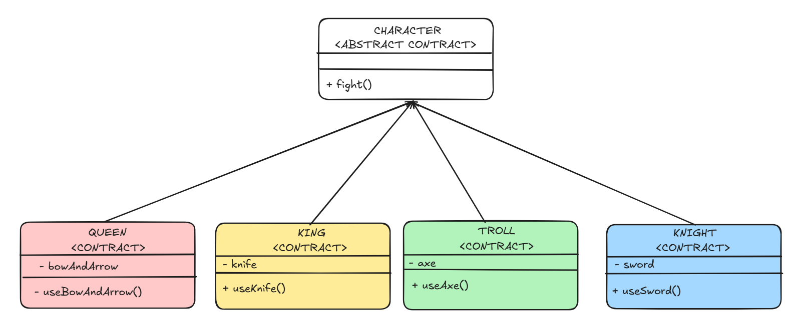

# Solidity: Strategy Pattern

## Design Challenge

Suppose one is tasked with developing a medieval GameFi protocol (for example) where one can play as a King, Queen, Troll, or Knight. The incentive to choose one character over another is that each uses different weapons to attack. Our first challenge would be to model each character considering the cycle of combat behavior. Later, we can address the actual damage impact of the weapons and other details.

### Naive Approach 1

One can say, "Well, I can start with a base abstract contract `character` that offers the `fight()` functionality to ber overriden by the specific attack function by the character.

The design would look something like this:"

  

where each weapon is contract that implements its custom attack. 

                        

**Challenges**

### Naive Approach 2

**Challenges**

### Strategy Pattern Approach

**Advantages**

## Workflow (Theory)

## Compound Example (Practical Example)
